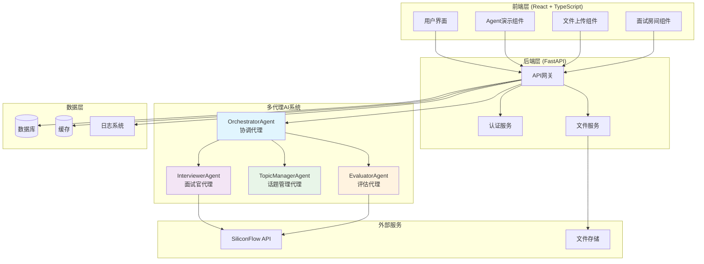
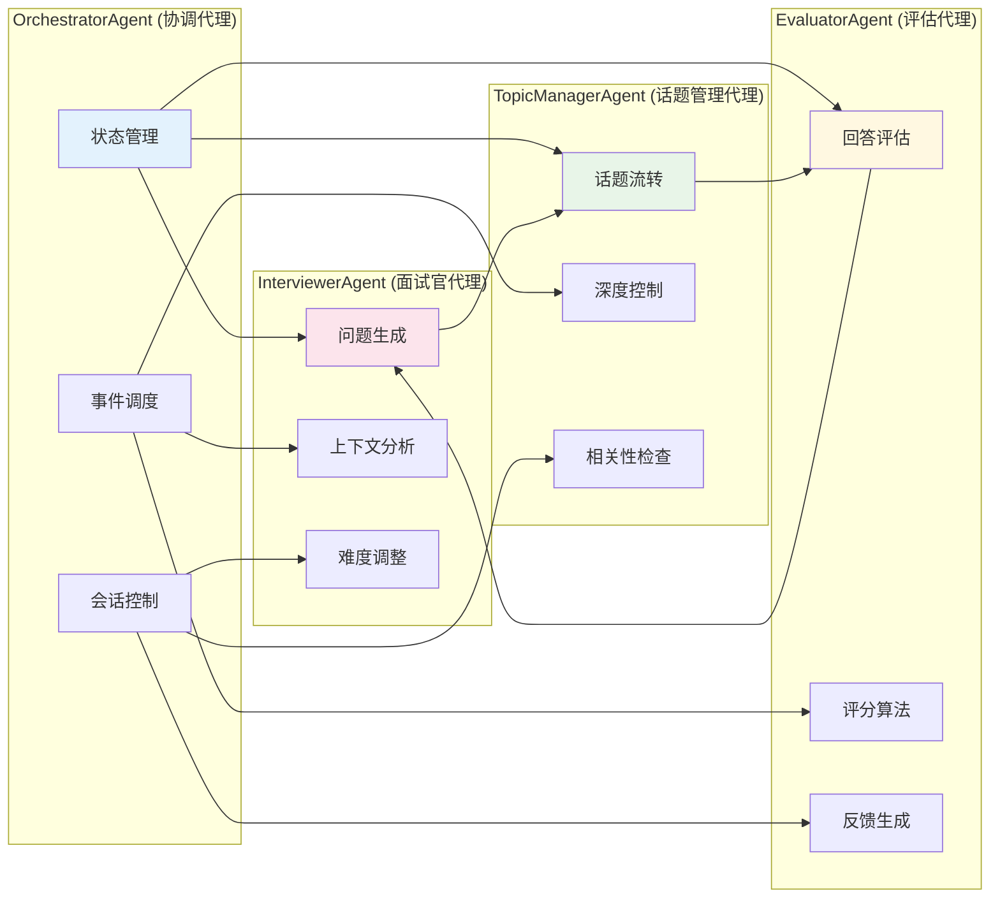
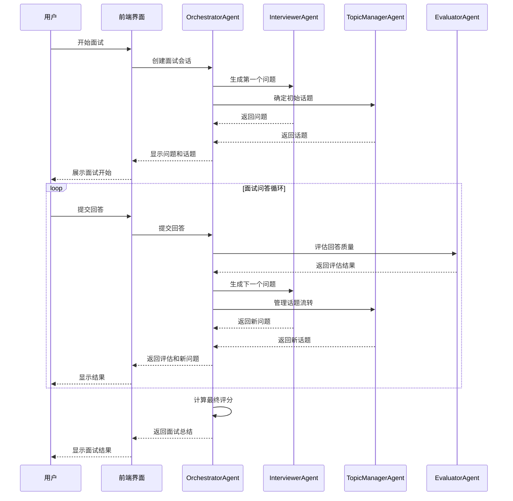
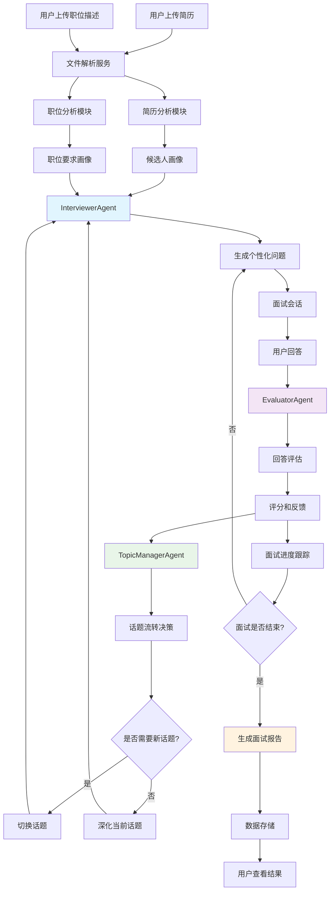
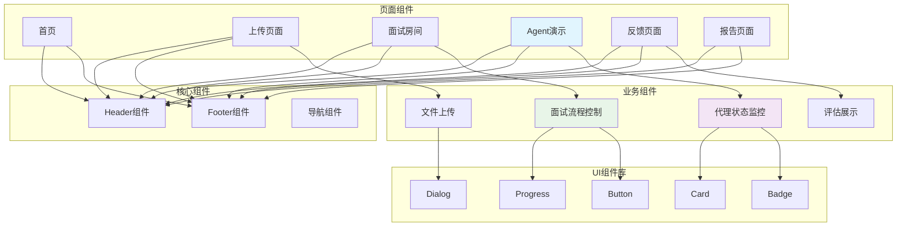
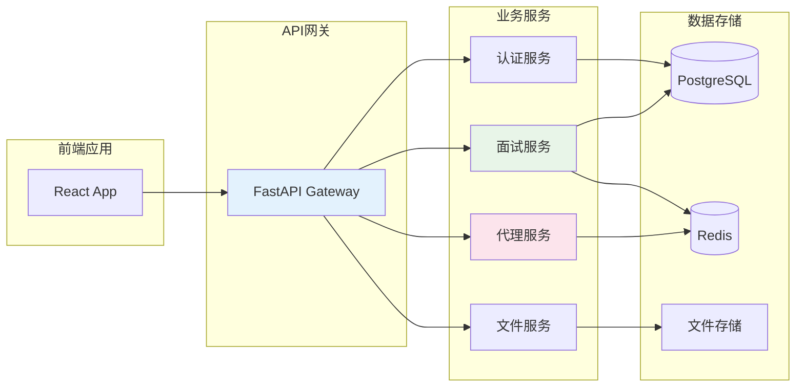
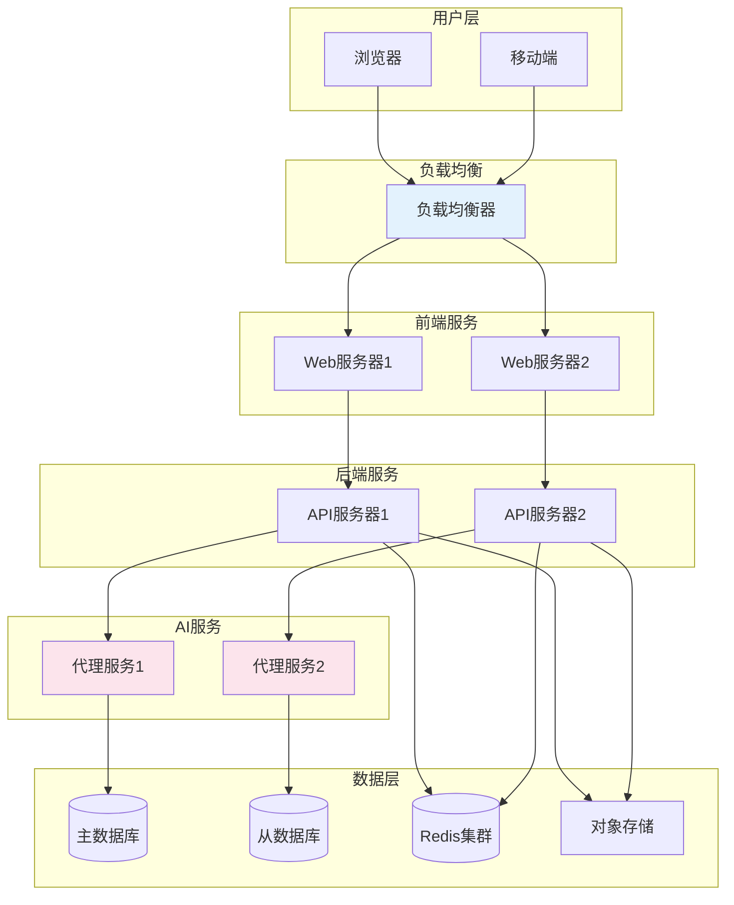
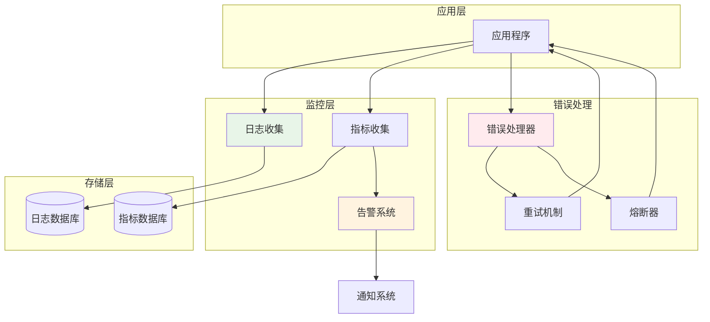

# AI面试系统 - 技术架构图和数据流程图

## 1. 系统整体架构图

```mermaid
graph TB
    subgraph "前端层 (React + TypeScript)"
        UI[用户界面]
        Demo[Agent演示组件]
        Upload[文件上传组件]
        Interview[面试房间组件]
    end
    
    subgraph "后端层 (FastAPI)"
        API[API网关]
        Auth[认证服务]
        File[文件服务]
    end
    
    subgraph "多代理AI系统"
        Orchestrator[OrchestratorAgent<br/>协调代理]
        Interviewer[InterviewerAgent<br/>面试官代理]
        TopicManager[TopicManagerAgent<br/>话题管理代理]
        Evaluator[EvaluatorAgent<br/>评估代理]
    end
    
    subgraph "数据层"
        DB[(数据库)]
        Cache[(缓存)]
        Logs[日志系统]
    end
    
    subgraph "外部服务"
        LLM[SiliconFlow API]
        Storage[文件存储]
    end
    
    UI --> API
    Demo --> API
    Upload --> API
    Interview --> API
    
    API --> Auth
    API --> File
    API --> Orchestrator
    
    Orchestrator --> Interviewer
    Orchestrator --> TopicManager
    Orchestrator --> Evaluator
    
    Interviewer --> LLM
    Evaluator --> LLM
    
    API --> DB
    API --> Cache
    API --> Logs
    
    File --> Storage
    
    style Orchestrator fill:#e1f5fe
    style Interviewer fill:#f3e5f5
    style TopicManager fill:#e8f5e8
    style Evaluator fill:#fff3e0
```

## 2. 多代理系统架构图

```mermaid
graph LR
    subgraph "OrchestratorAgent (协调代理)"
        OC[状态管理]
        OC2[事件调度]
        OC3[会话控制]
    end
    
    subgraph "InterviewerAgent (面试官代理)"
        IA[问题生成]
        IA2[上下文分析]
        IA3[难度调整]
    end
    
    subgraph "TopicManagerAgent (话题管理代理)"
        TA[话题流转]
        TA2[深度控制]
        TA3[相关性检查]
    end
    
    subgraph "EvaluatorAgent (评估代理)"
        EA[回答评估]
        EA2[评分算法]
        EA3[反馈生成]
    end
    
    OC --> IA
    OC --> TA
    OC --> EA
    
    OC2 --> IA2
    OC2 --> TA2
    OC2 --> EA2
    
    OC3 --> IA3
    OC3 --> TA3
    OC3 --> EA3
    
    IA --> TA
    TA --> EA
    EA --> IA
    
    style OC fill:#e3f2fd
    style IA fill:#fce4ec
    style TA fill:#e8f5e8
    style EA fill:#fff8e1
```

## 3. Agent协同工作流程图

```mermaid
sequenceDiagram
    participant User as 用户
    participant UI as 前端界面
    participant OC as OrchestratorAgent
    participant IA as InterviewerAgent
    participant TA as TopicManagerAgent
    participant EA as EvaluatorAgent
    
    User->>UI: 开始面试
    UI->>OC: 创建面试会话
    OC->>IA: 生成第一个问题
    OC->>TA: 确定初始话题
    IA-->>OC: 返回问题
    TA-->>OC: 返回话题
    OC-->>UI: 显示问题和话题
    UI-->>User: 展示面试开始
    
    loop 面试问答循环
        User->>UI: 提交回答
        UI->>OC: 提交回答
        OC->>EA: 评估回答质量
        EA-->>OC: 返回评估结果
        OC->>IA: 生成下一个问题
        OC->>TA: 管理话题流转
        IA-->>OC: 返回新问题
        TA-->>OC: 返回新话题
        OC-->>UI: 返回评估和新问题
        UI-->>User: 显示结果
    end
    
    OC->>OC: 计算最终评分
    OC-->>UI: 返回面试总结
    UI-->>User: 显示面试结果
```

## 4. 数据流程图

```mermaid
flowchart TD
    A[用户上传简历] --> B[文件解析服务]
    C[用户上传职位描述] --> B
    B --> D[简历分析模块]
    B --> E[职位分析模块]
    
    D --> F[候选人画像]
    E --> G[职位要求画像]
    
    F --> H[InterviewerAgent]
    G --> H
    H --> I[生成个性化问题]
    
    I --> J[面试会话]
    J --> K[用户回答]
    K --> L[EvaluatorAgent]
    
    L --> M[回答评估]
    M --> N[评分和反馈]
    N --> O[TopicManagerAgent]
    
    O --> P[话题流转决策]
    P --> Q{是否需要新话题?}
    Q -->|是| R[切换话题]
    Q -->|否| S[深化当前话题]
    
    R --> H
    S --> H
    
    N --> T[面试进度跟踪]
    T --> U{面试是否结束?}
    U -->|否| I
    U -->|是| V[生成面试报告]
    
    V --> W[数据存储]
    W --> X[用户查看结果]
    
    style H fill:#e1f5fe
    style L fill:#f3e5f5
    style O fill:#e8f5e8
    style V fill:#fff3e0
```

## 5. 前端组件架构图

```mermaid
graph TB
    subgraph "页面组件"
        Index[首页]
        Upload[上传页面]
        Interview[面试房间]
        Demo[Agent演示]
        Feedback[反馈页面]
        Report[报告页面]
    end
    
    subgraph "核心组件"
        Header[Header组件]
        Footer[Footer组件]
        Nav[导航组件]
    end
    
    subgraph "UI组件库"
        Button[Button]
        Card[Card]
        Badge[Badge]
        Progress[Progress]
        Dialog[Dialog]
    end
    
    subgraph "业务组件"
        AgentStatus[代理状态监控]
        InterviewFlow[面试流程控制]
        FileUpload[文件上传]
        Evaluation[评估展示]
    end
    
    Index --> Header
    Upload --> Header
    Interview --> Header
    Demo --> Header
    Feedback --> Header
    Report --> Header
    
    Index --> Footer
    Upload --> Footer
    Interview --> Footer
    Demo --> Footer
    Feedback --> Footer
    Report --> Footer
    
    Demo --> AgentStatus
    Interview --> InterviewFlow
    Upload --> FileUpload
    Feedback --> Evaluation
    
    AgentStatus --> Card
    AgentStatus --> Badge
    InterviewFlow --> Progress
    InterviewFlow --> Button
    FileUpload --> Dialog
    
    style Demo fill:#e1f5fe
    style AgentStatus fill:#f3e5f5
    style InterviewFlow fill:#e8f5e8
```

## 6. API接口架构图

```mermaid
graph LR
    subgraph "前端应用"
        React[React App]
    end
    
    subgraph "API网关"
        Gateway[FastAPI Gateway]
    end
    
    subgraph "业务服务"
        Auth[认证服务]
        Interview[面试服务]
        File[文件服务]
        Agent[代理服务]
    end
    
    subgraph "数据存储"
        DB[(PostgreSQL)]
        Cache[(Redis)]
        Storage[文件存储]
    end
    
    React --> Gateway
    Gateway --> Auth
    Gateway --> Interview
    Gateway --> File
    Gateway --> Agent
    
    Auth --> DB
    Interview --> DB
    Interview --> Cache
    File --> Storage
    Agent --> Cache
    
    style Gateway fill:#e3f2fd
    style Agent fill:#fce4ec
    style Interview fill:#e8f5e8
```

## 7. 部署架构图

```mermaid
graph TB
    subgraph "用户层"
        Browser[浏览器]
        Mobile[移动端]
    end
    
    subgraph "负载均衡"
        LB[负载均衡器]
    end
    
    subgraph "前端服务"
        Web1[Web服务器1]
        Web2[Web服务器2]
    end
    
    subgraph "后端服务"
        API1[API服务器1]
        API2[API服务器2]
    end
    
    subgraph "AI服务"
        Agent1[代理服务1]
        Agent2[代理服务2]
    end
    
    subgraph "数据层"
        DB1[(主数据库)]
        DB2[(从数据库)]
        Redis[(Redis集群)]
        Storage[对象存储]
    end
    
    Browser --> LB
    Mobile --> LB
    LB --> Web1
    LB --> Web2
    Web1 --> API1
    Web2 --> API2
    API1 --> Agent1
    API2 --> Agent2
    Agent1 --> DB1
    Agent2 --> DB2
    API1 --> Redis
    API2 --> Redis
    API1 --> Storage
    API2 --> Storage
    
    style LB fill:#e3f2fd
    style Agent1 fill:#fce4ec
    style Agent2 fill:#fce4ec
```

## 8. 错误处理和监控架构

```mermaid
graph TB
    subgraph "应用层"
        App[应用程序]
    end
    
    subgraph "监控层"
        Logger[日志收集]
        Metrics[指标收集]
        Alert[告警系统]
    end
    
    subgraph "错误处理"
        ErrorHandler[错误处理器]
        Retry[重试机制]
        Circuit[熔断器]
    end
    
    subgraph "存储层"
        LogDB[(日志数据库)]
        MetricsDB[(指标数据库)]
    end
    
    App --> Logger
    App --> Metrics
    App --> ErrorHandler
    
    ErrorHandler --> Retry
    ErrorHandler --> Circuit
    Retry --> App
    Circuit --> App
    
    Logger --> LogDB
    Metrics --> MetricsDB
    Metrics --> Alert
    
    Alert --> Notification[通知系统]
    
    style ErrorHandler fill:#ffebee
    style Alert fill:#fff3e0
    style Logger fill:#e8f5e8
```
